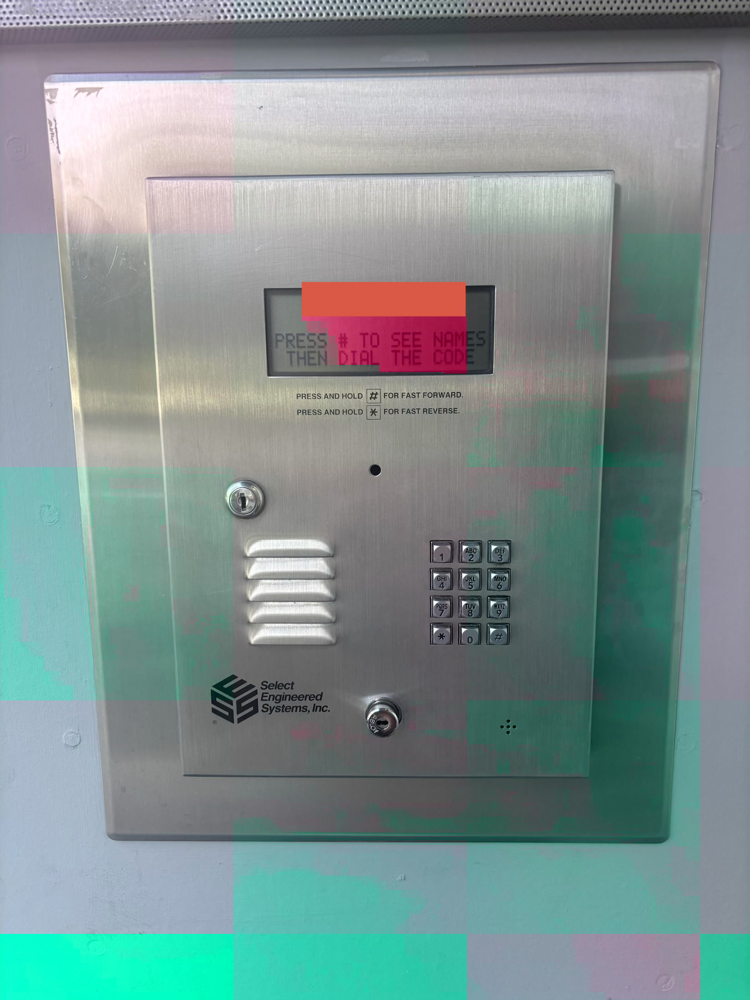

# Buzzer Automation

My building has a buzzer code system (See picture below) on which any guest has to enter a 4 digit pincode in order for it to send a call to my personal
phone number. During this call, I can reject the call or accept the call and press 9 on the phone's keypad in order to give the guest access into the building and lift.

"Buzzing in" people is especially important due to the constant rain that vancouver is famous for as well as the viscious seagulls that rob any packages not claimed within a few minutes left outside. 



However, with a 4 person apartment which can have a lot of deliveries, especially during 
university finals weeek, and recieving all of the buzzer code numbers to my number, I wondered:
"Is there any way to automate this process so that calls I don't reject gets sent the same keypad tone and allows the guest access?"

So here is the overview!


## How It Works

```
Buzzer calls your phone number
        │
        ▼
Call is instantly forwarded to Twilio (conditional forwarding)
        │
        ▼
Twilio webhook (this server) answers immediately
        │
        ▼
Detects buzzer caller ID → sends DTMF "9" (x3 for reliability)
        │
        ▼
Door opens. (Might add SMS Notification feature in newer version)
```

Non-buzzer calls are forwarded through to your phone normally.

---

## Setup Guide

### Steps!
### Step 1: Getting a Twilio Account
1. Sign up for a twilio number
2. Note your account SID, Auth Token and Twilio Phone Numbner

### Step 2: Deploy The Server

You need the server running on a public URL. I'm choosing render since I used that for hackathon recently.

1. Create a new web service on render
2. Set build command: `pip install -r requirements.txt`
3. Set start command: `gunicorn app:app --bind 0.0.0.0:$PORT --timeout 120`
4. Add environment variables

### Step 3: Configure Twilio Webhook

1. Click your purchased number
2. Under **Voice Configuration → A Call Comes In**:
   - Set to Webhook
   - URL: `https://thepublicurl.com`
   - Method: POST
4. Save

### Step 4: Set Up iPhone Call Forwarding (Conditional)

I'm using koodo so after setting up the prepaid plan of $5, I used the activation code to forward calls to the Twilio number

#### How this works with regular calls

All calls now go through Twilio, but the server handles them correctly:
- **Buzzer calls** → auto-answers with DTMF "9", door opens instantly
- **All other calls** → Twilio forwards them to your phone, so you still receive them normally

---

## Environment Variables

| Variable | Description | Example |
|---|---|---|
| `BUZZER_NUMBER` | The phone number your buzzer calls FROM | `+14155551234` |
| `YOUR_PHONE_NUMBER` | Your personal phone number | `+14155559999` |
| `TWILIO_PHONE_NUMBER` | Your purchased Twilio number | `+14155550000` |
| `TWILIO_ACCOUNT_SID` | From Twilio console | `ACXXXX...` |
| `TWILIO_AUTH_TOKEN` | From Twilio console | `xxxx...` |
| `DTMF_DIGIT` | Key to press (default: `9`) | `9` |
| `PAUSE_BEFORE_DTMF` | Seconds to wait before pressing (default: `1`) | `1` |
| `NOTIFY_SMS` | Send SMS when buzzer triggers (default: `true`) | `true` |

---

## Cost

- **Twilio phone number:** ~$1.15 USD/month (But on trial plan so $0 for current version since very small)
- **Incoming calls:** ~$0.60 CAD/min (a 10-second buzzer call costs less than $0.01 CAD), but $5 flat charge
- **Hosting:** Free tier on Render is sufficient for now

Total: **~$5-6/month** for typical usage, for which the buzzer code is used almost 3-4 times daily, so a lot of saving.
